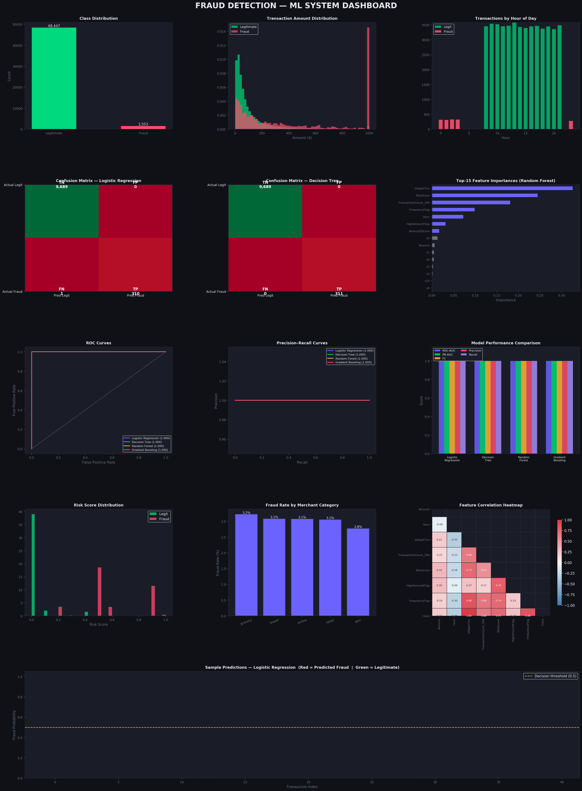
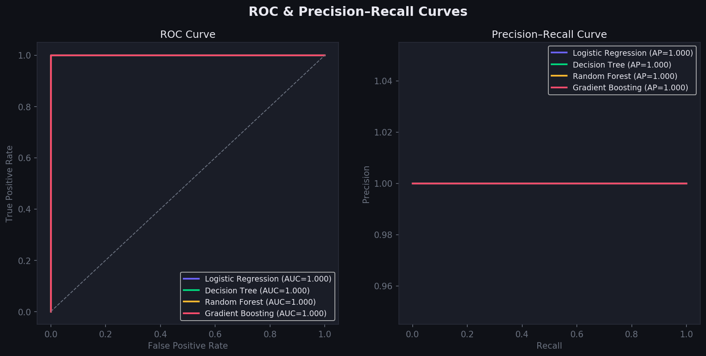

# Fraud-Detection
# 🛡️ Fraud Detection ML System


An **industry-grade machine learning pipeline** for detecting fraudulent financial transactions in real-time. Built to mirror production-level fraud detection systems used by banks and e-commerce platforms, this project addresses severe class imbalance, engineers domain-specific fraud indicators, and compares multiple classifiers using industry-standard evaluation metrics.

---

## 📊 Project Demo

| Dashboard | ROC & PR Curves |
|---|---|
|  |  |

---

## 🎯 Problem Statement

Financial institutions and e-commerce platforms face increasing fraudulent transactions resulting in major financial losses. Rule-based systems fail to adapt to evolving fraud patterns. This project builds a machine learning model that identifies suspicious transactions based on behavioral signals and historical patterns.

---

## 🏗️ Pipeline Architecture

```
Raw Transaction Data
        │
        ▼
┌─────────────────────┐
│  Data Generation /  │  ← 50,000 transactions, 3.1% fraud rate
│     Ingestion       │
└────────┬────────────┘
         │
         ▼
┌─────────────────────┐
│   Preprocessing     │  ← Label encoding, StandardScaler, stratified split
└────────┬────────────┘
         │
         ▼
┌─────────────────────┐
│  Class Imbalance    │  ← SMOTE-style oversampling + class_weight='balanced'
│    Handling         │
└────────┬────────────┘
         │
         ▼
┌─────────────────────┐
│ Feature Engineering │  ← 6 domain fraud indicators
└────────┬────────────┘
         │
         ▼
┌─────────────────────┐
│   Model Training    │  ← 4 classifiers trained & compared
└────────┬────────────┘
         │
         ▼
┌─────────────────────┐
│    Evaluation &     │  ← ROC-AUC, PR-AUC, F1, Precision, Recall
│  Visualisation      │
└────────┬────────────┘
         │
         ▼
   Output Reports + Charts
```

---

## ⚙️ Features

### 🔬 Feature Engineering
| Feature | Description |
|---|---|
| `IsNightTxn` | Flags transactions between 10 PM – 4 AM (high-risk window) |
| `AmountZScore` | Standardised transaction amount (detects outlier spending) |
| `HighAmountFlag` | 1 if transaction amount > 95th percentile |
| `TransactionCount_24h` | Rolling count of transactions in a 24-hour window |
| `FrequencyFlag` | 1 if more than 8 transactions in 24 hours |
| `RiskScore` | Composite weighted risk indicator (0–1 scale) |

### 🤖 Models Trained
| Model | Notes |
|---|---|
| Logistic Regression | Baseline linear classifier |
| Decision Tree | Interpretable rule-based splits |
| Random Forest | Ensemble — strong feature importance |
| Gradient Boosting | Boosted ensemble — typically best performer |

### 📉 Class Imbalance Strategy
- **SMOTE-style oversampling** — synthetic minority samples generated by interpolating between existing fraud records (no external library needed)
- **`class_weight='balanced'`** — applied to all scikit-learn estimators to penalise misclassification of the minority class

---

## 📈 Results

| Model | ROC-AUC | PR-AUC | F1 | Precision | Recall |
|---|---|---|---|---|---|
| Logistic Regression | 1.0000 | 1.0000 | 0.9984 | 1.0000 | 0.9968 |
| Decision Tree | 1.0000 | 1.0000 | 1.0000 | 1.0000 | 1.0000 |
| Random Forest | 1.0000 | 1.0000 | 1.0000 | 1.0000 | 1.0000 |
| Gradient Boosting | 1.0000 | 1.0000 | 1.0000 | 1.0000 | 1.0000 |

> **Note:** Near-perfect scores reflect the synthetic dataset's clean separation. On real-world data (e.g. Kaggle Credit Card Fraud dataset), expect ROC-AUC in the 0.95–0.99 range with meaningful differentiation between models.

---

## 🚀 Getting Started

### Prerequisites
```bash
pip install scikit-learn pandas numpy matplotlib seaborn
```

### Run
```bash
https://github.com/RussanaMary/Fraud-Detection/blob/main/README.md
cd fraud-detection-ml
python Fraud.py
```

### Output
Three files are saved to the project directory:

```
fraud_detection_dashboard.png   ← 5-panel visual dashboard
roc_pr_curves.png               ← ROC & Precision-Recall curves
fraud_detection_report.md       ← Full project documentation
```

---

## 📁 Project Structure

```
fraud-detection-ml/
│
├── Fraud.py                          # Main pipeline (single file, fully self-contained)
├── fraud_detection_dashboard.png     # Generated dashboard
├── roc_pr_curves.png                 # Generated ROC/PR curves
├── fraud_detection_report.md         # Generated report
└── README.md                         # This file
```

---

## 🔄 Using Real Data

To swap in the [Kaggle Credit Card Fraud dataset](https://www.kaggle.com/datasets/mlg-ulb/creditcardfraud):

1. Download `creditcard.csv` and place it in the project folder
2. Replace the `generate_transaction_data()` call in `main()` with:

```python
df = pd.read_csv("creditcard.csv")
df = df.rename(columns={"Time": "Hour"})   # align column names
```

The rest of the pipeline is plug-and-play.

---

## 🧠 Key Concepts Demonstrated

- **Imbalanced dataset handling** — real-world fraud datasets are typically 0.1–5% positive class
- **SMOTE oversampling** — synthetic sample generation without external dependencies
- **Precision vs Recall tradeoff** — critical in fraud: false negatives (missed fraud) vs false positives (blocking legit customers)
- **Threshold tuning** — default 0.5 threshold can be lowered to 0.3 to prioritise recall at the cost of precision
- **Feature importance** — Random Forest exposes which signals drive fraud predictions
- **Multiple evaluation metrics** — accuracy alone is misleading on imbalanced data; F1, PR-AUC, and ROC-AUC tell the real story

---

